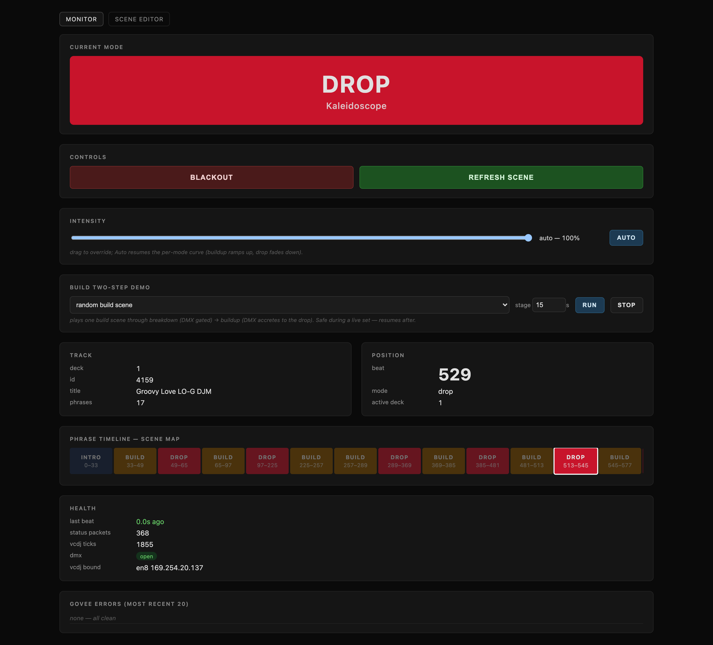
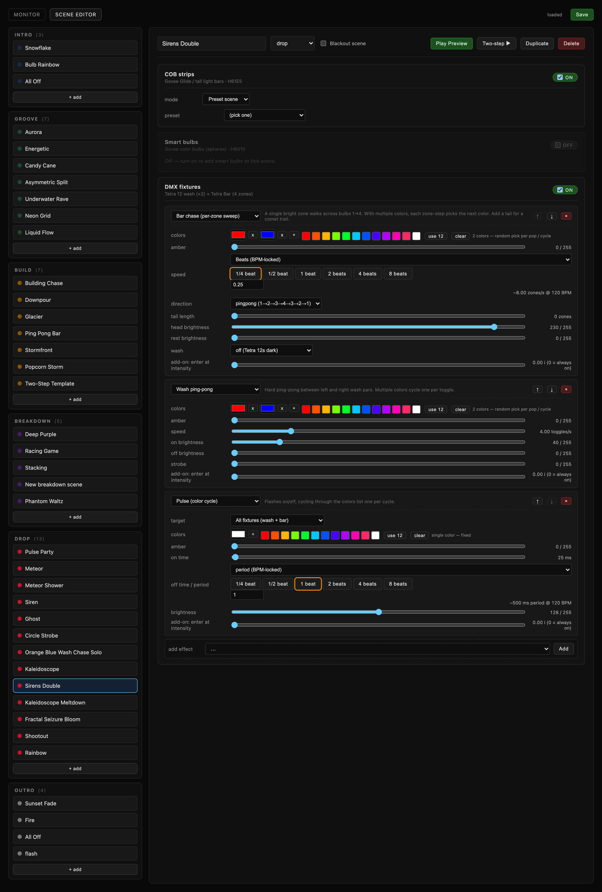

<div align="center">

# Pabst-DJ-Lighting

**Phrase-aware DJ lighting. The decks drive the rig.**

Pioneer Pro DJ Link → Rekordbox phrase analysis → scene engine → DMX + Govee, in real time.


**Live monitor, mid-drop** | **Scene designer studio**
:---: | :---:
[](docs/screenshots/monitor-drop.png) | [](docs/screenshots/scene-editor.png)

*Load a track on the decks and the rig follows the song's own structure — intro, groove, buildup, drop, breakdown, outro each get their own lighting vocabulary. Edit any scene live from the designer while the set keeps playing.*

</div>

---

## What it does

Every time a track loads on the XDJ-XZ, the system pulls the song's **phrase structure straight out of Rekordbox** (PSSI phrase data, over the Pioneer Pro DJ Link network) and maps each phrase — intro, groove, buildup, drop, breakdown, outro — to a pool of purpose-built lighting scenes. As beats advance, the engine knows exactly where in the track you are and swaps scenes on phrase boundaries, at section-appropriate intensity:

```
XDJ track loaded
  → fetch Rekordbox PSSI phrases over NFS (via vcdj peer)
  → map phrases to modes (intro/groove/buildup/breakdown/drop/outro)
XDJ beat updates (CDJ-Status packets on port 50002)
  → pick active deck (hysteresis on crossfade)
  → section_for_beat() → current mode
  → direct_lights.apply_mode(mode)
       → DMX render thread (Enttec Open DMX, ~1ms frames)
       → Govee LAN UDP (~10ms) with cloud fallback
```

- **39 scenes across 6 categories**, built in the bundled scene designer — layered DMX effects (chase, bar chase, wash ping-pong, pulse, strobe, popcorn, random flash) combined with Govee preset scenes.
- **Dual-deck aware**: analysis is pre-fetched for both decks, and active-deck hysteresis keeps lights from flapping between tracks mid-mix.
- **Scene designer studio**: full CRUD editor with live preview — hot-swaps a scene into the running engine, mid-set, without a restart. Includes a two-step build demo that plays any buildup through its real breakdown→buildup intensity curve.
- **Live monitor**: current mode, scene, beat position, phrase timeline, engine health, manual intensity override, and blackout — all at a glance from any browser.
- **Sub-millisecond DMX** via libftdi, **Govee LAN control** at ~10ms per command — fast enough to hit on the beat.

## The rig it drives

| Layer | Hardware |
| --- | --- |
| Decks | Pioneer XDJ-XZ (Pro DJ Link over ethernet, link-local) |
| DMX | Enttec Open DMX USB → 2× Tetra 12 wash + Tetra Bar (4 zones) |
| Ambient | Govee COB strips + smart bulbs (LAN UDP, cloud fallback) |
| Analysis host | Mac mini, single Python process |

## Quickstart

```bash
brew install libftdi portaudio
python3.13 -m venv .venv && .venv/bin/pip install -r requirements.txt

# main stack: Pro DJ Link client + scene driver + dashboard (:8787)
.venv/bin/python dj-lights/main.py

# or just the dashboard (monitor + scene editor)
.venv/bin/python dj-lights/dashboard.py
```

Requires the XDJ-XZ on the link-local subnet and `~/.config/govee/credentials.json` for Govee control — full details in [SETUP.md](SETUP.md). The scene editor and monitor work without any hardware attached.

## Docs

- [**dj-lights/README.md**](dj-lights/README.md) — internals: architecture, file map, Pro DJ Link protocol notes
- [**HANDOFF.md**](HANDOFF.md) — the Pro DJ Link deep dive: what it takes to keep an XDJ-XZ talking to you
- [**dj-lighting-system.md**](dj-lighting-system.md) — system design
- [SETUP.md](SETUP.md) · [TODO.md](TODO.md)

<div align="center">

*Built for apartment sets in Milwaukee. Now lighting rigs wherever the decks land.*

</div>
